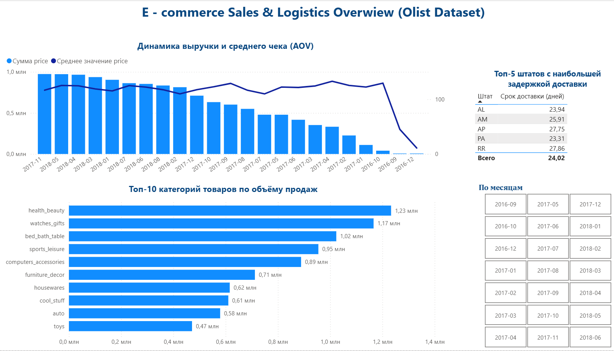

# 📊 Аналитический BI-проект: Исследование коммерческих показателей и логистики маркетплейса Olist

Источник данных: Olist Brazilian E-commerce Public Dataset (реальные обезличенные данные маркетплейса за 2016–2018 годы).

## 📌 О проекте 
Проект представляет собой BI-анализ коммерческих и логистических показателей маркетплейса Olist на основе открытого набора реальных обезличенных данных (массив данных включает более 100 000 заказов). 

Цель проекта — воспроизвести типовой BI-процесс анализа данных: подготовить данные в PostgreSQL, сформировать витрину данных и построить интерактивный отчет для анализа ключевых бизнес-показателей.

## 🛠️ Используемые технологии
* **Базы данных (СУБД):** PostgreSQL 14 (развертывание сервера, написание многотабличных JOIN-запросов).
* **BI-платформа:** Power BI Desktop (сбор данных через SQL-инструкции, проектирование плоских витрин данных, условное форматирование, фильтрация Top-N).

## 🏗️ Архитектура и этапы реализации:
1. **Проектирование СУБД и импорт данных:** Развернул локальную базу данных в PostgreSQL. Создал реляционную схему из 5 связанных таблиц и импортировал исходные данные. Привел временные поля к типу TIMESTAMP и денежные значения к NUMERIC, чтобы корректно рассчитывать сроки доставки и финансовые показатели.
2. **Подготовка витрины данных (SQL)** Для подготовки данных к визуализации сформировал SQL-витрину, объединив данные из нескольких таблиц. Основные вычисления выполнил на стороне PostgreSQL, чтобы использовать в Power BI уже подготовленный набор данных.
3. **Разработка бизнес-дашборда:** Напрямую подключил Power BI к PostgreSQL в режиме *Import*. Разработал интерактивный дашборд: реализовал интерактивную фильтрацию по месяцам, внедрил логику динамического ограничения элементов (Top-10/Top-5) и применил условное градиентное форматирование.
   

---

## 📈 Визуализация дашборда

---

## Бизнес-вопросы

В рамках проекта были исследованы следующие вопросы:

- Как менялась выручка по месяцам?
- Какие категории товаров формируют основную долю продаж?
- Как связаны сроки доставки и оценки покупателей?
- Какие регионы имеют наиболее длительную доставку?

## 💡 Ключевые бизнес-инсайты (На основе анализа реальных данных)
* **Коммерческий тренд:** Выручка маркетплейса демонстрирует выраженную восходящую динамику по месяцам. При этом средний чек (AOV) остается стабильным, что указывает на рост бизнеса за счет увеличения объема заказов и привлечения новых клиентов, а не за счет роста стоимости корзины.
* **Ассортиментный анализ:** С помощью фильтрации Top-N выделены 10 ключевых категорий товаров, формирующих основной поток выручки платформы (товары для дома, индустрия красоты, спорт/отдых).
* **Операционные проблемы логистики:** На основе расчета реальных сроков доставки и внедрения условного форматирования были локализованы топ-5 штатов с критической задержкой логистики. Полученные результаты могут использоваться как основание для дополнительного анализа работы служб доставки в данных регионах.

## Ограничения анализа

Данные содержат реальные обезличенные сведения о заказах маркетплейса Olist за 2016–2018 годы.
В наборе отсутствуют:
- себестоимость товаров;
- расходы на рекламу;
- складские остатки;
- информация о возвратах.

Поэтому анализ сосредоточен на продажах, доставке и клиентском опыте и не включает оценку прибыльности бизнеса.

## 📁 Структура репозитория
* `query.sql` — финальный SQL-запрос витрины данных из PostgreSQL.
* `Olist_Ecommerce_Analytics.pbix` — рабочий файл отчета Power BI со всеми визуализациями.

## Что было реализовано

- импорт данных в PostgreSQL;
- проектирование схемы хранения;
- написание SQL-запросов с использованием JOIN и агрегатных функций;
- подготовка витрины данных;
- подключение Power BI к PostgreSQL;
- разработка интерактивного дашборда;
- формулировка бизнес-выводов по результатам анализа.

